# EDA

### Datasets used:
- final_proposal.project_clean
- final_project.location_clean
- fp_approved.deployment_projects
- fcc_nbm.nbm_hive

Plots Directory consists of figures that have been generated so far

---

## Visualizations

### Viz 1 — Target distributions
Histograms of `bead_support` and `funding_per_location`, raw vs `log1p`, showing why the target gets a log transform.

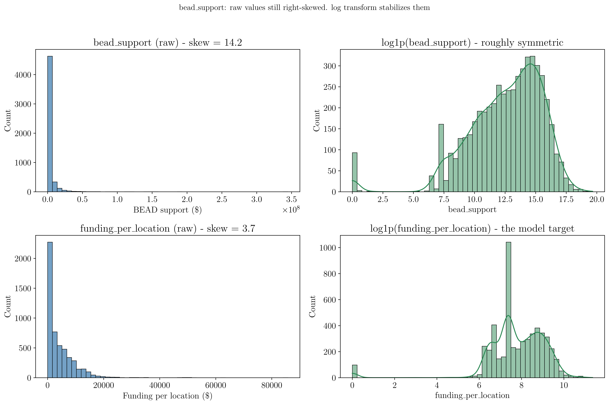

Heavy right skew of data in it's raw form. So we cannot use tests like the t-test for testing our Hypothesis. Hence we log transform them
### Viz 2 — Cost by categorical drivers
Box plots of `funding_per_location` by priority flag and project type (log y).

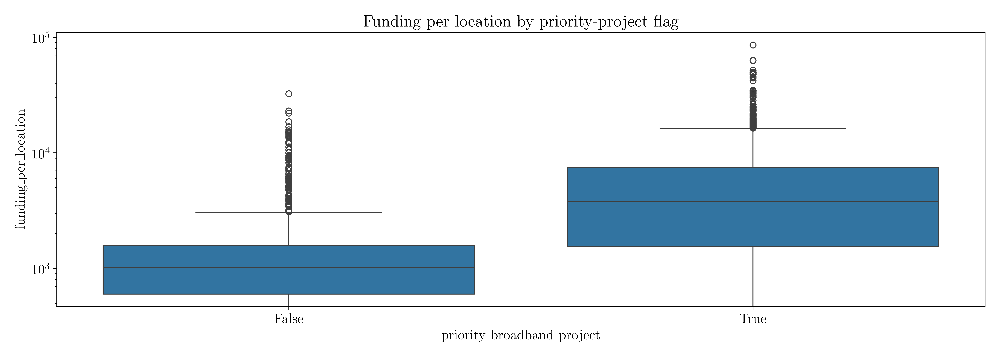

Priority projects are given more funding than non-priority projects. Majority of these priority projects being fiber based projects. We can infer that the FCC has given a lot of priority to fiber based projects over other technologies 

### Viz 2b — What kinds of projects are "priority"?
`project_type` is ~99% one category, so the meaningful split is by **dominant technology**. Left: the technology mix within priority projects. Right: priority vs non-priority composition.

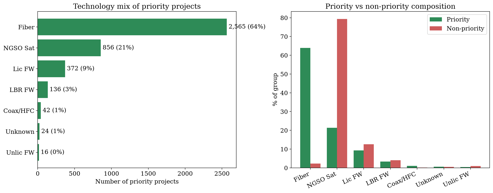

Priority projects are overwhelmingly **fiber** (64%), while non-priority projects skew heavily to **satellite** (79%). Priority status tracks the more capital-intensive wireline builds.

### Viz 3 — Correlation matrix
Pearson correlations among the numeric features and the target.

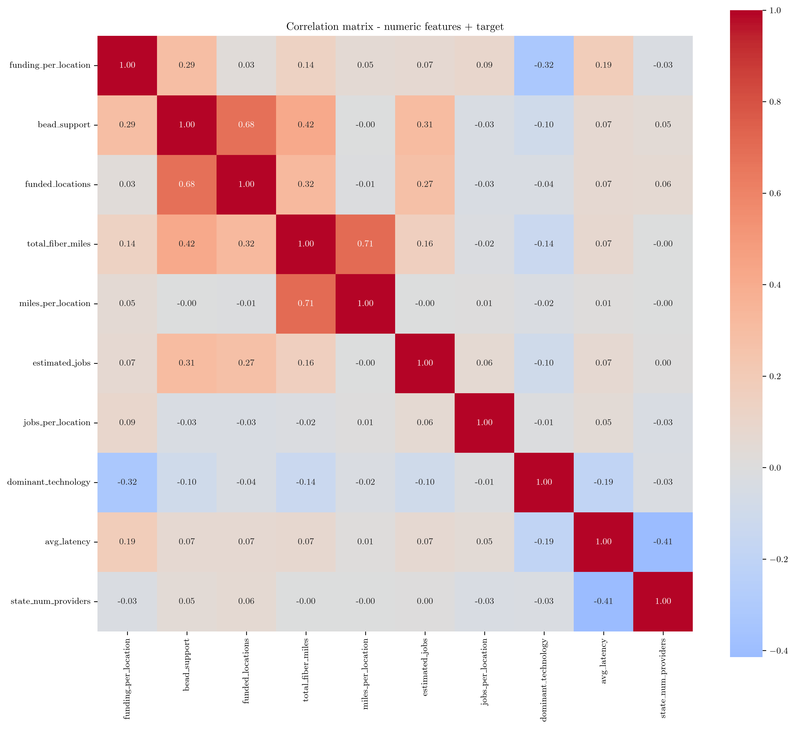

### Viz 4a — Cost by state
Mean `funding_per_location` per state with bootstrap 95% confidence intervals.

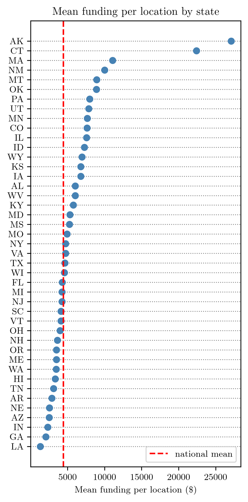

Bootstrapping is a non-parametric technique used to estimate the sampling distribution of a statistic by repeatedly sampling (with replacement) from your original dataset.The width of the error bars tells us a lot about the underlying data distribution within each state, especially given the title notes this only includes states with 5 or more projects. Connecticut (CT) and Massachusetts (MA) have massive confidence intervals. This infers that their funding amounts are highly skewed or volatile—they likely have a mix of very small projects and a few massive outlier projects. When the bootstrap resamples those massive outliers, the mean jumps wildly, creating a wide interval. Louisiana (LA) and Georgia (GA) have very tight intervals. This infers that their funding per location is highly consistent across projects, or they have a much larger sample size that suppresses the variance. Alaska (AK) and New Mexico (NM) genuinely receive higher-than-average funding. Even in their worst-case simulated scenarios (the left edge of their black lines), they sit well above the red national average line. If you only looked at the blue dot, you would infer that Connecticut is the second-best funded state. However, the massive black line spanning nearly the entire width of the chart tells us that this average is wildly unreliable. It is almost certainly being dragged up by one or two massive outlier projects, while their typical project receives far less.

### Viz 4b — Project count by state
Number of funded projects per state.

Indiana, Washington and Orlando appear to be the states that have the most number of projects while North Dakota, Delaware, Hawaii and Conneticut have a very low. project count. 

### Viz 5 — Feature vs. target
Log-scaled scatters of `funding_per_location` against its strongest physical drivers.

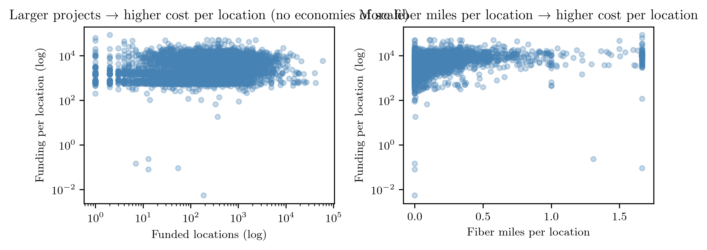

Fiber miles seem to affect the amount of funding the project gets. The more fiber miles a particular project has, the more funding it receives. Additionally, larger the project is, the more funding it gets

### Viz 6 — BEAD support vs fiber miles
Log-log scatter of BEAD support vs total fiber miles, colored by aerial/buried dominance.

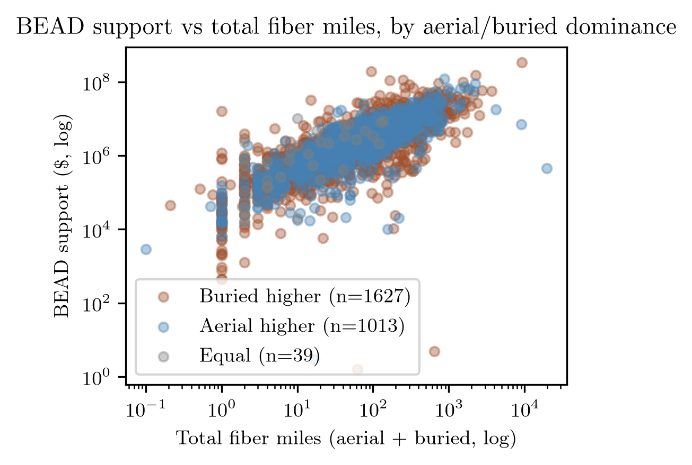

This visualization was created to see if projects that have more aerial fiber miles have more funding than buried fiber miles or vice versa. On examining the graph we can infer from the cloud generated, that projects tht have more buried or more aerial fiber miles are relatively same and not a significant indicator of whether it receives mroe funding

### Viz 7 — Cost by technology
Box plots of BEAD support per project by dominant technology (log y), ordered by median.

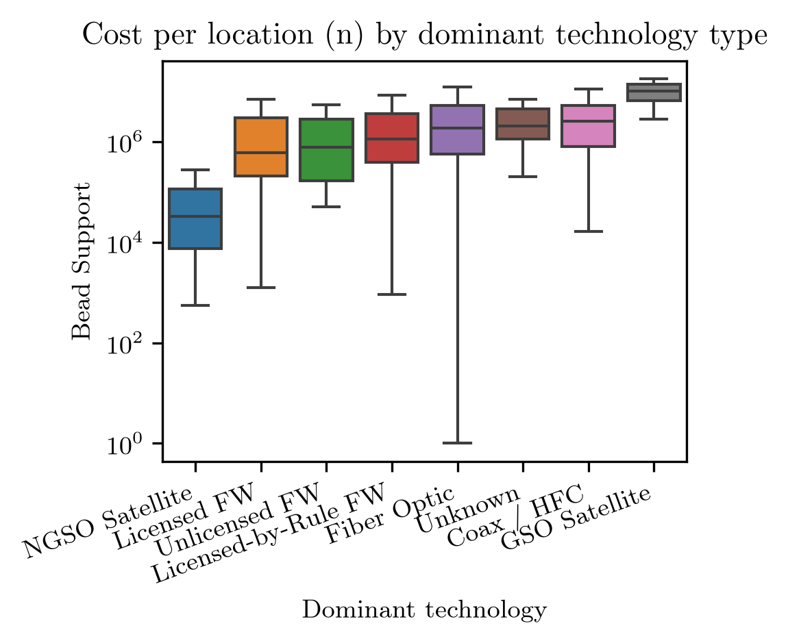

Fiber based project

### Viz 7b — Fiber vs others
Box plots of BEAD support per project, fiber optic vs all other technologies combined (log y).

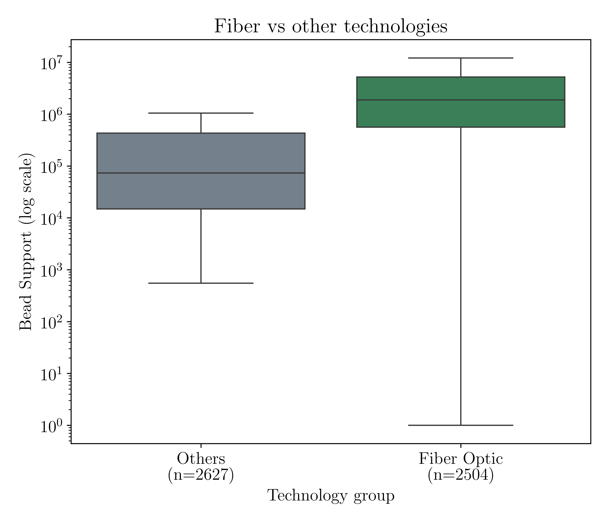

Fiber based projects have a higher 

### Viz 8 — QQ plots (normality check)
Raw vs `log1p` of `bead_support` and `funding_per_location` against a normal distribution.

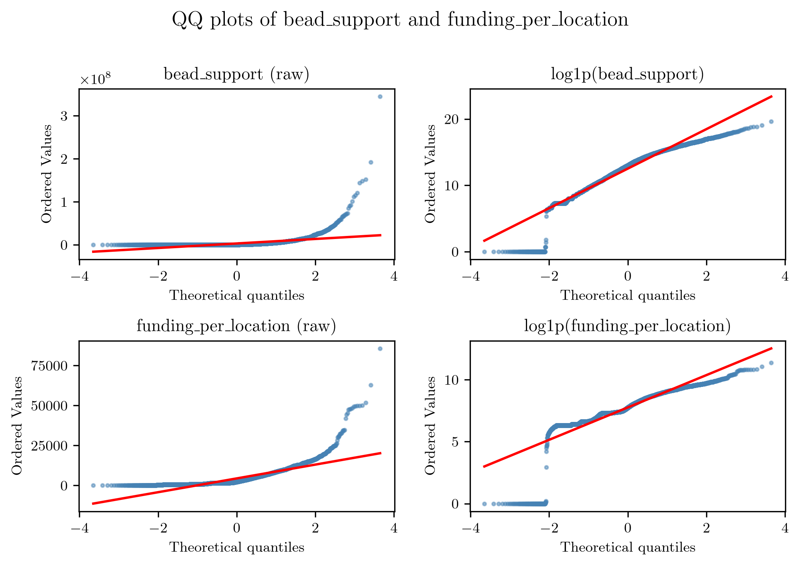

### Viz 9 — Funded vs proposed
Log-log scatter of deployed vs final-proposal BEAD support for accepted projects.

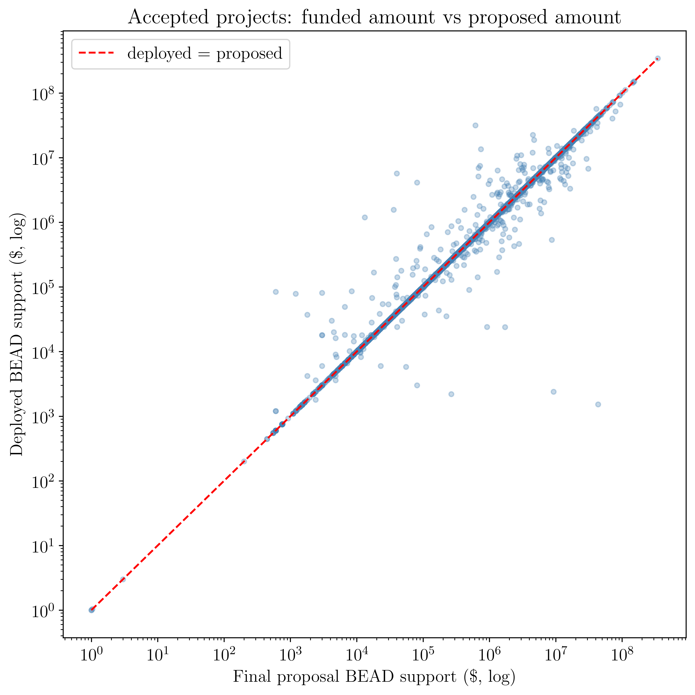

### Viz 9b — Funded vs proposed (central 95%)
Same as Viz 9 but clipped to the central 95% of BEAD support (log-log).

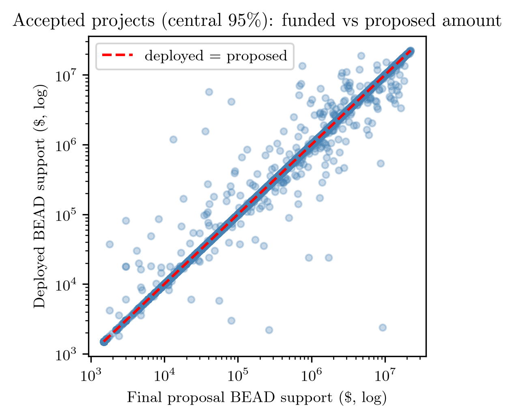

### H6 — Governor incumbency (state-level)
State median cost per location by governor incumbency status.

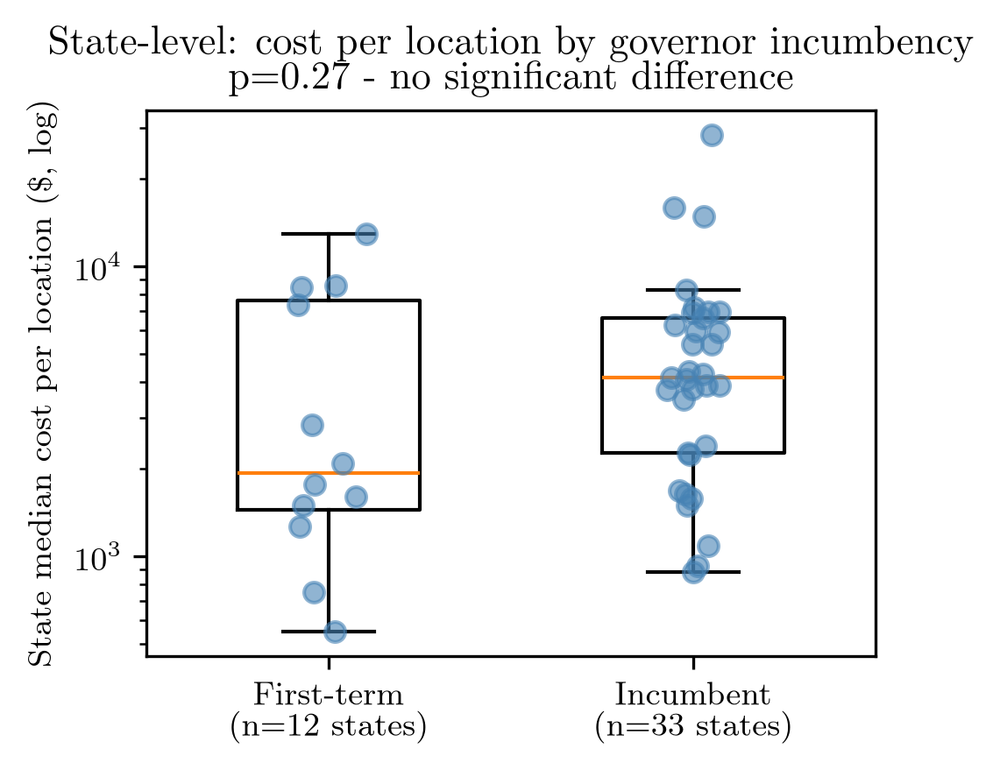

### H7 — Technology market share
Share of projects by technology.

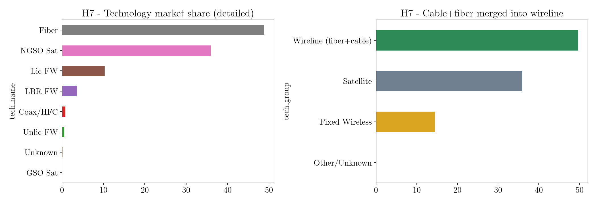

---

## Additional EDA Visualizations

### Viz 10 — Distribution of funding per location, raw vs. log
Side-by-side histograms of `funding_per_location` (raw) and `log1p(funding_per_location)`, justifying the log transform. Pairs with Viz 8 (QQ plots).

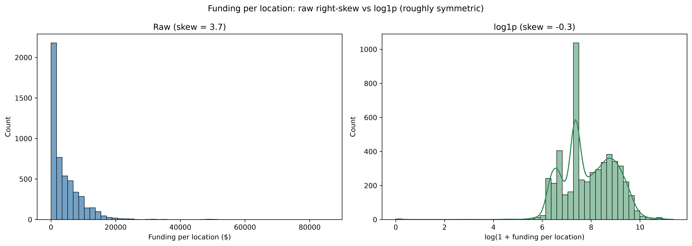

### Viz 11 — Choropleth of mean funding per location by state
US state map colored by mean `funding_per_location`.

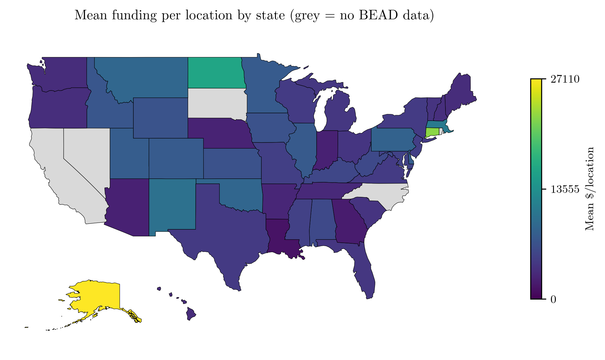

### Viz 12 — miles_per_location vs. funding_per_location (log-log), by technology
Log-log scatter of the strongest continuous predictor against the target, colored by dominant technology.

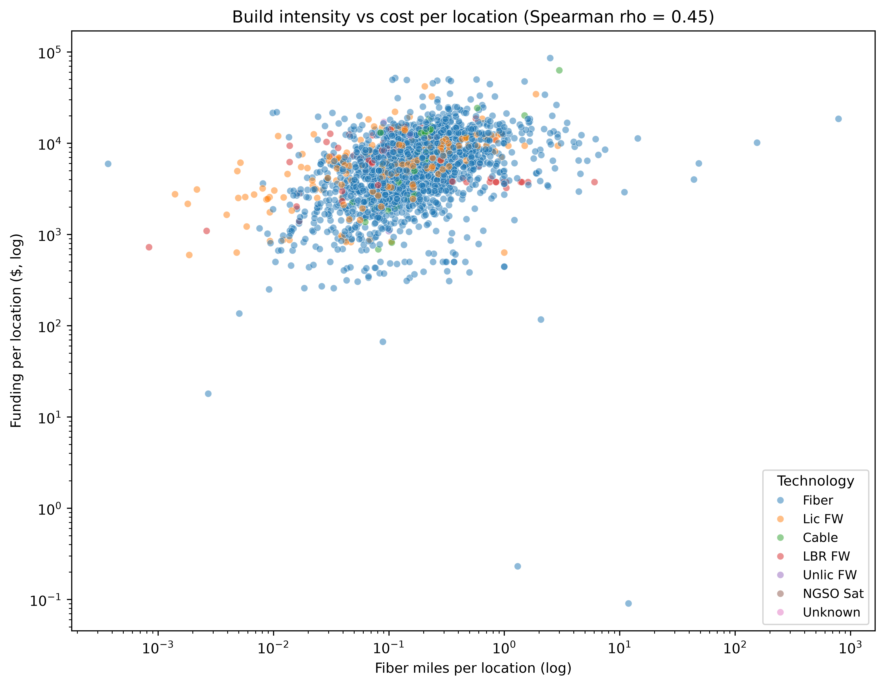

### Viz 13 — Correlation heatmap of candidate features
Correlation matrix across candidate features + target, doubling as a collinearity diagnostic.

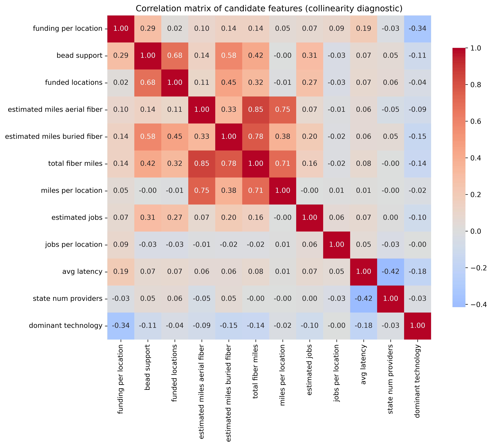

---

## Inferences

_Write your inferences for each visualization below._

- **Viz 1 — Target distributions:**
- **Viz 2 — Cost by categorical drivers:**
- **Viz 3 — Correlation matrix:**
- **Viz 4a — Cost by state:**
- **Viz 4b — Project count by state:**
- **Viz 5 — Feature vs. target:**
- **Viz 6 — BEAD support vs fiber miles:**
- **Viz 7 — Cost by technology:**
- **Viz 7b — Fiber vs others:**
- **Viz 8 — QQ plots:**
- **Viz 9 — Funded vs proposed:**
- **Viz 9b — Funded vs proposed (central 95%):**
- **H6 — Governor incumbency:**
- **H7 — Technology market share:**
- **Viz 10 — Distribution raw vs. log:**
- **Viz 11 — Choropleth of funding by state:**
- **Viz 12 — miles_per_location vs. funding (by technology):**
- **Viz 13 — Correlation heatmap:**

### Overall takeaways
_Write your high-level conclusions here._

-
